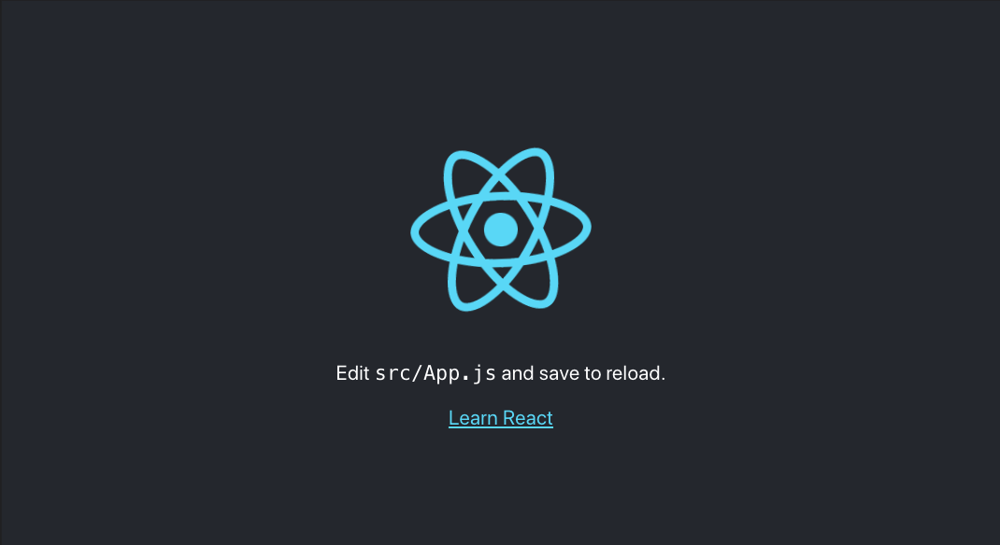

# OLX Women Workshop - Frontend

## Requirements

- [Node v17+](https://nodejs.org/en/)
- NPM v8.5+ (Automatically installed with Node)
- [Docker (Desktop for Mac/Windows, Engine for Linux)](https://www.docker.com/get-started)
- Your terminal of choice
- Your favorite text editor, we recommend [VS Code](https://code.visualstudio.com) for this workshop

# Development

## Initial Setup

We'll start by using [Create React App](https://reactjs.org/docs/create-a-new-react-app.html#create-react-app) to quickly bootstrap our single-page application:

```sh
npx create-react-app mini-olx-frontend
```

and move to the newly created folder

```sh
cd mini-olx-frontend
```

At the root of the project, let's create a `.env` file to hold our project variables. This will come in hand later. You can read more about it [here](- https://create-react-app.dev/docs/adding-custom-environment-variables/#adding-development-environment-variables-in-env).

```sh
REACT_APP_API_BASE="http://localhost:4040"
```

Now run

```sh
npm start
```

and you can see your application running at [http://localhost:3000/](http://localhost:3000/).


